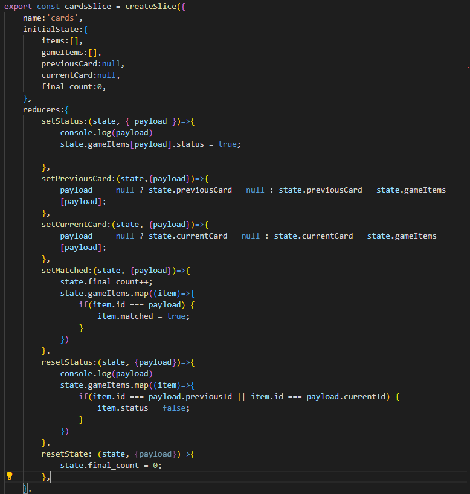
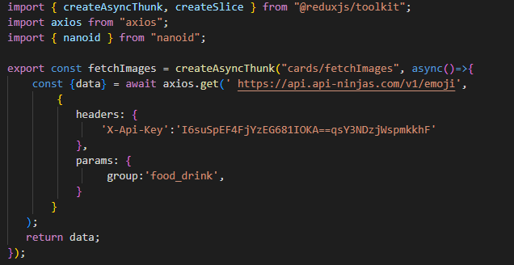
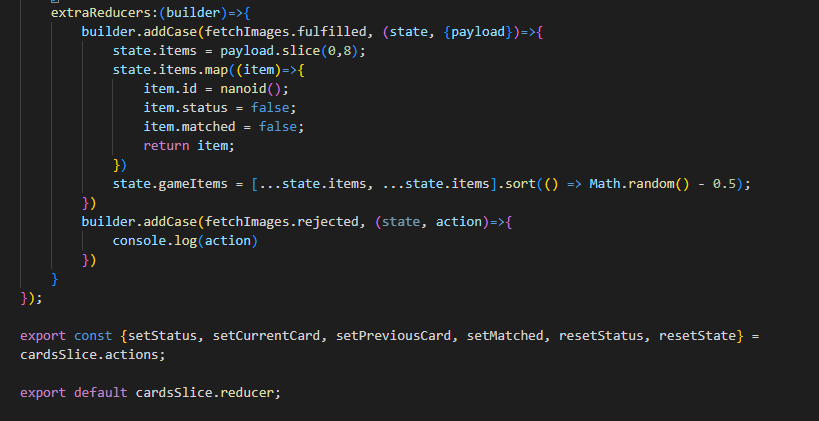

<h1>Memo-card Game on React, React-redux-toolkit</h1>
<h2>I used <a href="https://api-ninjas.com/api/emoji" target="_blank">Emoji API</a> for generating images</h2>
<h2>Also, used redux-toolkit </h2>
<h3>Here is how look slice</h3>

<h3>This is how I made requests to Emoji API</h3>

<h3>This is how I handle the request proccess</h3>

